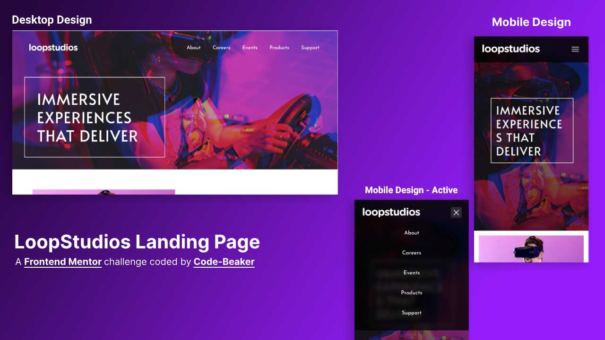

# LoopStudios Landing Page 🎉

This is a solution to the **LoopStudios Landing Page** challenge from **[Frontend Mentor](https://frontendmentor.io)**.

- [LoopStudios Landing Page 🎉](#loopstudios-landing-page-)
  - [Preview 🖼️](#preview-️)
  - [Built with ⚒️](#built-with-️)
    - [Languages](#languages)
    - [Others](#others)
  - [Process and workflow 📖](#process-and-workflow-)
    - [Start a project with Vite](#start-a-project-with-vite)
    - [Coding the project](#coding-the-project)
    - [What I learned](#what-i-learned)
  - [Links 🔗](#links-)

## Preview 🖼️

Here's a preview image of the website



_Created with **[Photopea](https://photopea.com)**._

## Built with ⚒️

Everything used to build this website

### Languages

- Semantic HTML
- SCSS
- CSS
- JavaScript

### Others

- [Visual Studio Code](https://code.visualstudio.com)
- [Vite](https://vitejs.dev)
- [Brave](https://brave.com)
- [Firefox](https://mozilla.org/firefox)
- [Ubuntu 23.10](https://ubuntu.com)

## Process and workflow 📖

Here's a short view of the overall workflow

### Start a project with Vite

Inside the project folder, I initialised a vanilla Vite application

```bash
npm create vite@latest -- --template vanilla app

cd app/

npm install

npm add sass -D

npm run dev
```

After the coding part was done, I compiled the files for production using

```
npm run build
```

### Coding the project

This part took around a week. Coded with Visual Studio Code entirely and tested with **Mozilla Firefox(127)** and **Brave's latest build**. Tested on **Samsung Galaxy A13** for responsiveness.

Used SCSS so that I can make my workflow better and faster with nesting and mixins. I didn't wait for the project to be finished. Instead, I pushed it to github and deployed using Vercel to make sure the live site also works as expected.

### What I learned

I learned to make grid layouts and make them responsive for smaller screen sizes.
I learned to make use of `position: absolute` to build different elements on the site and make them adapt to different screens.

## Links 🔗

See the source code and live site.

- GitHub Repository: **[Visit ➤](https://github.com/Code-Beaker/loopstudios-landing-page-code-beaker)**
- Vercel Deploy: **[Visit ➤](https://loopstudios-landing-page-code-beaker.vercel.app/index.html)**
